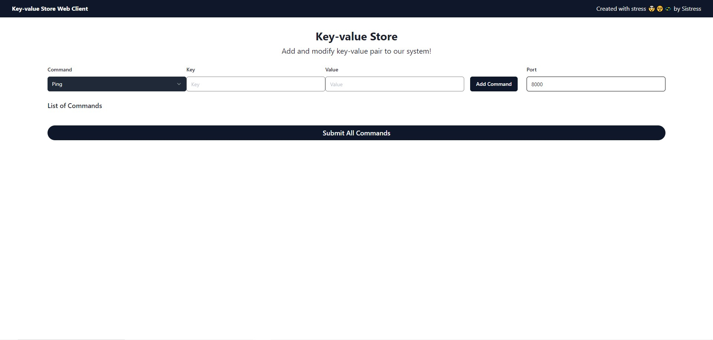

<br />
<div align="center">
  <a href="https://github.com/Sister20/if3230-tubes-sistress.git">
    
  </a>
  <h3 align="center">Sistress - Consensus Protocol: Raft</h3>

  <p align="center">
    Key-Value Store using Raft Consensus Protocol
    <br />
    <a href="https://github.com/raft"><strong>cr: Raft Github »</strong></a>
    <br />
  </p>
</div>

  

<!-- TABLE OF CONTENTS -->
<details>
  <summary>Table of Contents</summary>
  <ol>
    <li>
      <a href="#about-the-project">About The Project</a>
    </li>
    <li>
      <a href="#features">Features</a>
    </li>
    <li><a href="#how-to-use">How To Use</a></li>
    <li><a href="#contributors">Contributors</a></li>
  </ol>
</details>

# About The Project
This project is a distributed key-value in-memory storage system that offers several core functionalities and ensures consistency and availability within a cluster. The system is implemented using Python, Flask, NodeJS, and React. The system is based on the Raft consensus protocol, which is a consensus algorithm for managing a replicated log. It allows a collection of machines to work as a single coherent group that can survive the failures of some of its members.



# Features
## Core Services
| Service | Description | Command | Response |
| --- | --- | --- | --- |
| Ping | Check connection with the server | `ping` | `PONG` |
| Get | Retrieve value associated with a key | `get <key>` | `"value"` |
| Set | Set a value for a key | `set <key> <value>` | `OK` |
| Strln | Retrieve length of value associated with a key | `strln <key>` | `<length>` |
| Del | Delete entry associated with a key | `del <key>` | `"value"` |
| Append | Append a value to the existing value of a key | `append <key> <value>` | `OK` |
| Request Log | Request log entries from node | `request_log` | `log_entries` |

## Distributed System Features
| Feature | Description |
| --- | --- |
| Membership Change | Mechanism to add and remove server nodes dynamically |
| Log Replication | Cluster action logging system to replicate logs across nodes for consistency |
| Heartbeat | Periodic messages to monitor node health and maintain connections |
| Leader Election | Mechanism for leader node failover to ensure high availability and fault tolerance |

# How To Use
1. Clone the repository
   ```bash
   git clone https://github.com/Sister20/if3230-tubes-sistress.git
   cd if3230-tubes-sistress
   ```
2. Start Server nodes
   ```bash
   # Leader node
   python3 server.py <ip> <port>
   # Follower node
   python3 server.py <ip> <port> <leader_ip> <leader_port>
   ```
3. Start Client
   ```bash
   python3 Client.py <ip> <port>
   ```
4. Start Web Interface
   ```bash
   cd web
   npm install
   npm run dev
   ```
5. Open `http://localhost:3000/` in your browser

# Contributors
| NIM | Name | Task |
| --- | --- | --- |
| 13521108 | Michael Leon Putra Widhi | KV Store App, Client, Web Client, Unit Test KV Store App |
| 13521131 | Jeremya Dharmawan Raharjo | Leader Election, Web Client |
| 13521132 | Dhanika Novlisariyanti | Replicate Log, Unit Test Replicate Log |
| 13521155 | Kandida Edgina Gunawan | Heartbeat, Unit Test Heartbeat |
| 13521172 | Nathan Tenka | Membership, Unit Test Membership |
